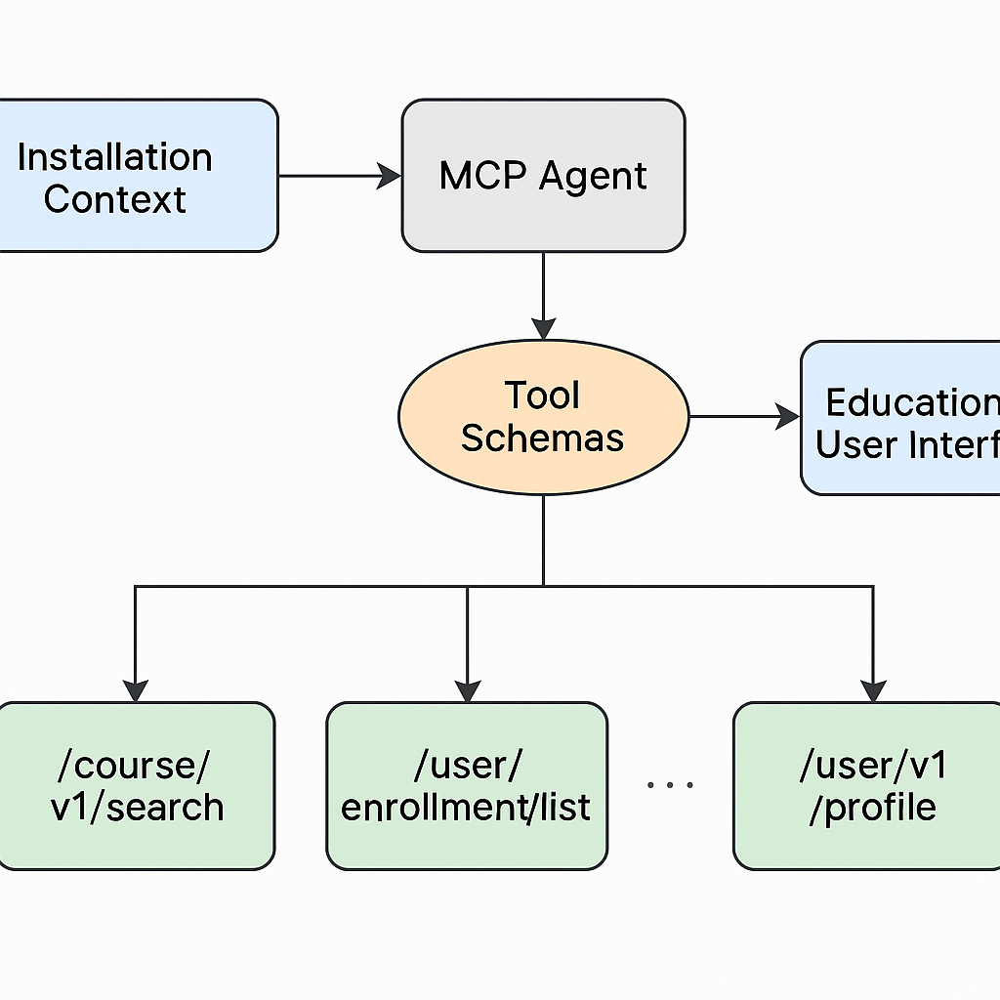

# 🧠 Architecture Overview - Sunbird Ed AI Assistant (MCP Integration)

This document outlines the internal architecture of the **Sunbird Ed AI Assistant**, which integrates with the **Sunbird Ed** learning platform using **Model Context Protocol (MCP)** concepts and a tool-calling LLM interface.

---

## 📊 System Architecture Diagram

> _Figure: High-level system workflow demonstrating how components interact using MCP._

---

## 🧩 Key Components

### 1. **Installation Context**
- Holds environment-specific metadata and contextual information (e.g., organization name, API base URL).
- Injected into the MCP Agent to influence reasoning and responses.

### 2. **MCP Agent**
- Central logic hub powered by **LLaMA 3** via **Ollama**.
- Uses the Model Context Protocol-inspired structure to determine tool usage based on user queries and context.
- Processes context, user input, and tool schema descriptions to intelligently decide tool calls.

### 3. **Tool Schemas**
- JSON-based descriptions of tools/endpoints available to the agent.
- Includes metadata like input/output format, descriptions, and usage rules.
- Acts as an API capability definition.

### 4. **Tool Layer (Mock APIs)**
- Simulated local endpoints replicating Sunbird Ed API behavior:
  - `/course/v1/search` – Fetch course metadata.
  - `/user/enrollment/list` – Retrieve enrollment info.
  - `/user/v1/profile` – Display learner profile and progress.
- These can be swapped with real endpoints in future integrations.

### 5. **User Interface (CLI or Web)**
- Simple command-line interface to test contextual queries.
- Could be extended to a web-based chatbot in future phases.

---

## 🔁 Data Flow Summary

1. User submits a query (e.g., "Show my enrolled courses").
2. The **MCP Agent** receives the query, enriched with **Installation Context**.
3. The agent interprets the request and selects a tool based on **Tool Schemas**.
4. The tool fetches mock (or real) API data.
5. The result is sent back to the user through the interface.

---

## 🧱 Future Enhancements

- 🔌 Replace mocked APIs with live Sunbird APIs.
- 🌐 Add a web-based frontend.
- 🧠 Integrate official MCP Agent SDK when available.
- 🔍 Add support for fine-grained personalization and recommendations.

---

## 📂 File Reference

| File | Description |
|------|-------------|
| `context/installation_context.py` | Loads environment context for MCP |
| `llm/mistral_wrapper.py` | LLM interface using Ollama |
| `tools/*.py` | Individual tool interfaces |
| `configs/tool_schemas.json` | Tool definitions |
| `cli/main.py` | CLI-based user interface |

---

## 📌 Notes

- This system is built to be modular, extensible, and ready for full-scale MCP-based educational agents.
- Designed to align with the goals of **Digital Public Infrastructure** in education.

---

For additional context, refer to the main [README.md](README.md) file.
